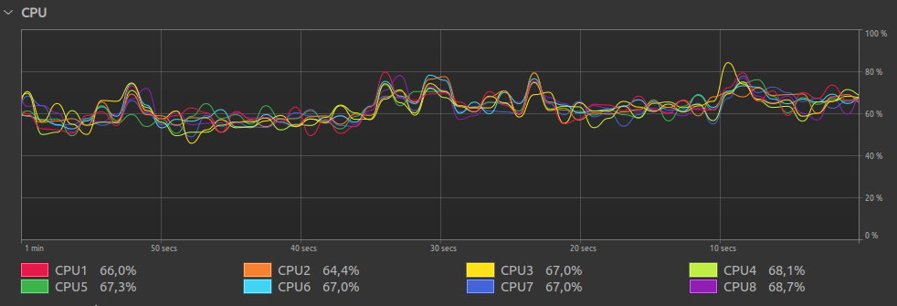

<h1 style="text-align: center">MiniConvo</h1>

A minimalist chatroom built for millions of concurrent connections.

<h4 style="text-align: center">Efficient multithreading</h4>

Leveraging the power of virtual threads, the server is able to open millions of concurrent connections, and distributing the load evenly.

<h4 style="text-align: center">Built for scale</h4>

Zero configuration to achieve massive concurrency.

<h4 style="text-align: center">Minimal</h4>

Does one thing, and does it well. Includes the server and the client already pre-configured and ready to go.

